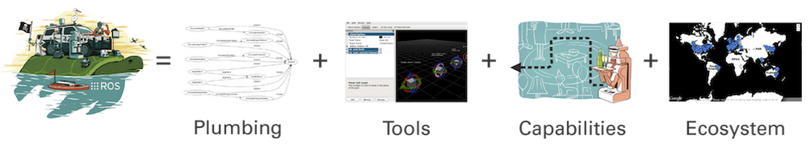
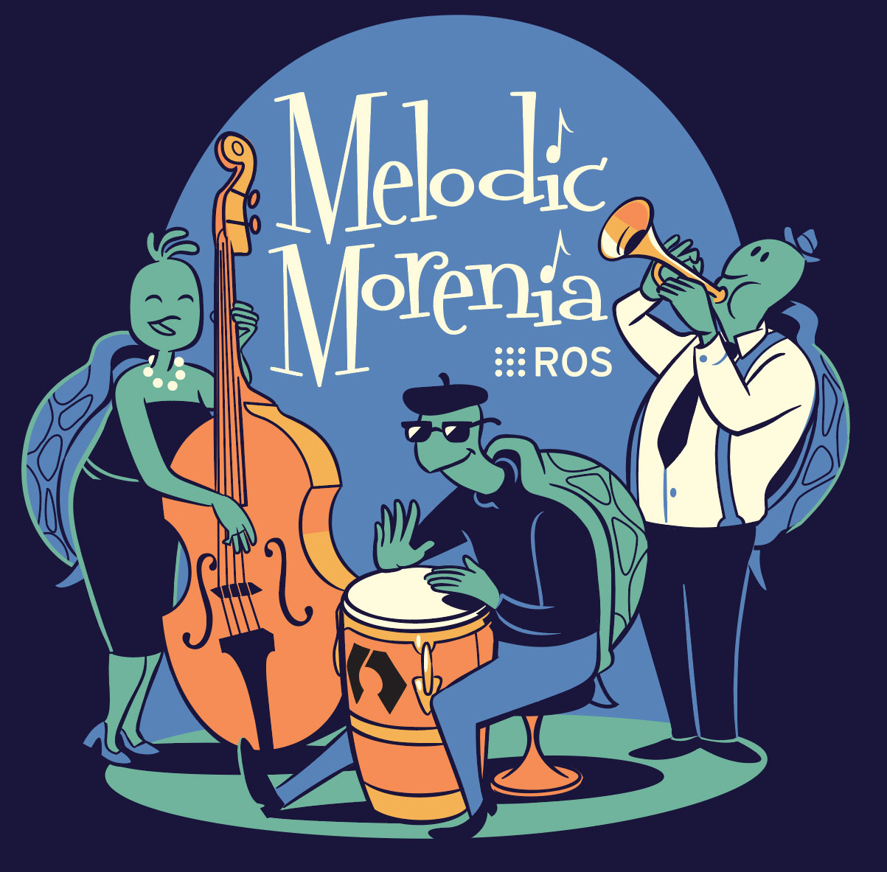
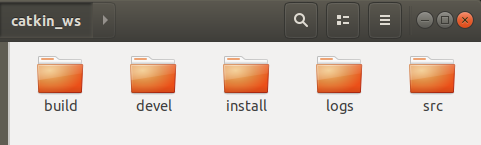
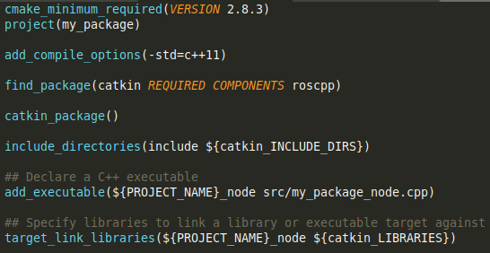
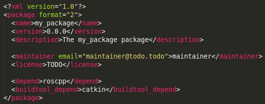

## Foreword
This document provides a very brief introduction to Robot Operating System (ROS) and some of its components.
This document assumes that the reader is an absolute beginner to ROS and has minimal understanding of Linux build systems.
This means that only a high-level conceptual overview is presented here. 
Wherever possible, links to technical content and implementation details are provided, the reader is enncouraged to go through them.

## 1. Introduction
### What is ROS?
ROS is a framework for writing software for robots. 
Even though the name contains the term *Operating System*, it is not a complete operating system.
It is rather a collection of software tools and libraries that enables programming complex robot behaviours across a wide variety of robot platforms. (see \[[1](https://www.ros.org/about-ros/)\], \[[2](http://wiki.ros.org/)\]) The tools that ROS offers can be categorized as shown in Table 1 and illustrated in Figure 1.

Table 1 - Summary of some key components in ROS (\[[3](https://www.researchgate.net/publication/314101187_Programming_for_Robotics_-_Introduction_to_ROS)\]).

| Plumbing | Tools | Capabilities | Ecosystem |
|----|----|----|----|
| Process Management | Visualization | Control | Package Organization |
| Inter-process Communication | Simulation | Planning | Software Distribution |
| Device Drivers | GUI | Perception | Documentation |
| | Data Logging | Mapping | Tutorials |
| | Hardware Abstraction | Manipulation | Forums | 

  
Figure 1 - The ROS equation illustrating the components of ROS (\[[1](https://www.ros.org/about-ros/))\].

### Why use ROS?
1. ROS is **modular**, meaning one can choose to use only specific components of ROS in their frameworks.  
2. ROS programs can be **distributed** across multiple computers.  
3. ROS modules can be written in **multiple languages**, as long as a client library exists (e.g. C++, Python, Matlab, Java).  
4. ROS can be used as a generic tool to interact with multiple robot platforms, by **abstracting the hardware**. For example, one can write code to acquire images from a generic camera and use it to interact with cameras from different manufacturers (assuming a ROS driver for a particular camera is available).
5. ROS has a **large community** of users which enables transfer of knowledge and code across industry and academia which helps in collaborative research and product development.
6. ROS has a **permissive license** (three-clause BSD) enabling reuse in both open source and closed source products. Code built using ROS can also be commercialized.  

### History
ROS was originally developed in 2000s at Stanford University and further developed by Willow Garage from 2007-2013.
The first official release of ROS was ROS Box Turtle which was released on 2nd March, 2010.
Since 2013 the Open Source Robotics Foundation has been managing and maintaining ROS.

<p align="center">
    </br>
    Figure 2 - Turtles for all the ROS-1 versions.
</p>
<!--    -->

### Versions and Operating Systems
There are two main versions of ROS; ROS 1 and ROS 2.
ROS 2 is still in its early stages, at the time of this document, and has not been fully adopted by the community.
Hence this document will only cover topics related to ROS 1. 
Throughout this document when we use ROS, we refer to ROS 1.
The latest long term stable distribution of ROS 1 for Ubuntu 18.04 at the time of this document is [ROS Melodic Morenia](http://wiki.ros.org/melodic).

<p align="center">
    </br>
    Figure 3 - The poster of ROS Melodic Morenia.  
</p>
<!--  -->

While it is possible to install ROS in Linux, MacOS and Windows, it is easiest to install in Linux.
We shall assume that the operating system of the user is Linux (more specifically Ubuntu 18.04).

## 2. Installation
Follow [this guide](http://wiki.ros.org/melodic/Installation/Ubuntu) to install ROS Melodic in Ubuntu 18.04.

## 3. Understanding ROS at a File System Level.
This sections present an overview of ROS as it appears in the file system.

### 3.1 The workspace
Software developed using ROS is generally written in a ROS workspace - more commonly referred to as a *catkin workspace*.
In simple terms a catkin workspace is just a folder with some special settings in it.
These settings make sure that software packages written by a user are built and maintained in a clean way, with all the dependencies being found correctly, and let ROS be aware of these packages.
The name of the folder can be whatever you like.
Most online tutorials call this *catkin_ws* and so we will use the same name to keep things consistent.
One may create as many catkin workspaces as desired, however it is a good practice to group packages with a common end application into one workspace.

A catkin workspace can be created by first creating a normal folder and invoking the `catkin_init_workspace` or the `catkin init` command (from [python-catkin-tools](https://catkin-tools.readthedocs.io/en/latest/installing.html)). 

```bash
mkdir -p catkin_ws/src
cd catkin_ws/src
catkin_init_workspace
```
or 
```bash
mkdir -p catkin_ws/src
cd catkin_ws
catkin init
```
**Notes**:  
1. `catkin init` is slightly better than `catkin_init_workspace` and is recommended.  
2. `catkin init` is run from the workspace folder while `catkin_init_workspace` is run from the src folder.  
3. Using `catkin init` creates a hidden folder named *.catkin_tools* inside the workspace folder where the special settings are stored.  
4. Using `catkin_init_workspace` creates a file called *CMakeLists.txt* in the src folder. 
This is referred to as the top-level cmake file and is a symbolic link to the file */opt/ros/\<version\>/share/catkin/cmake/toplevel.cmake*.

### 3.1.1 The workspace structure

<p align="center">
    </br>
    Figure 4. A Typical ROS workspace.
</p>

The workspace consists of 4 main folders which are as follows (see Figure 4).  
1. **src** - This is where your source code lies, organized into packages.  
2. **build** - This is the build space for your source code. Intermediate build files are written to this folder.  
3. **devel** - This is where the *targets* (executables, libraries, scripts, shared C++ headers) that are built are located. This folder also contains files that define the context of a ROS environment.  
4. **logs** - This is where logs lie.  
5. **install** - \[Optional\] - This is where the executables and libraries are installed to.

One would only work and modify files in the **src** folder and not touch the **build** and **devel** folders.

So far, we only created the **src** folder and the other folders do not exist yet.
They appear once you build your code. (Build is also referred to as *compile* or *make*).
This can be done by using either `catkin_make` or `catkin build`.  
**Note**: Please use only one of them and once you choose one, stick to it for the rest of the workflow. We recommend using `catkin build`.
You should now see the other folders.

### 3.2 catkin build system
**What happened when you invoked the above command?**  
ROS uses a custom **build system** called **catkin**.
This build system compiled the code present in the **src** folder in the **build** folder and put the built executables and libraries in the **devel** folder.
At this point, as the **src** folder is empty, the **build** and **devel** folders only have some standard packages and setup files.

**So, what is a build system?**  
A build system takes source code and generates targets (executables, libraries, headers) from them.
Let us take the example of building a C++ code written in one header file *header.h* located in the folder *include_folder* and one source file *code.cpp* and dependant on one library *libdep.so*.  

Building it using the **GNU C++** compiler would be as follows.
```bash
g++ -Iinclude_folder code.cpp -ldep -o output
```
This command looks quite simple for this example.
However, if you have a lot of source files, headers and multiple libraries that the code depends, using the above command can get quite cumbersome.  

Luckily this can be automated with a build system.
We configure the build system to let it know where the compiler is, where the source code, include files and libraries are, what libraries to link, what *targets* need to be built and where they have to be installed to.

One of the popular build systems is the CMake build system \[[4](https://cmake.org/)\].
In CMake, the configuration is specified in a file called *CMakeLists.txt*.

**catkin** is a wrapper (another layer above) the CMake build system. (python-catkin-tools are slightly more advanced, however the concept is similar.)  

More details can be found [here](http://wiki.ros.org/catkin/conceptual_overview).

### 3.3 ROS Packages
Let us now take a closer look at the contents of the **src** folder and more specifically how to write code that uses ROS.

In ROS terminology code is organized into **packages**, with each package consisting code for one or more *targets* to be built.
They can also just be datasets or configuration files.
In general, ROS packages follow a "*Goldilocks*" principle: enough functionality to be useful, but not too much that the package is heavyweight and difficult to use from other software.

Each package is a separate folder in the **src** folder and must contain 2 files.  
1. **CMakeLists.txt** - Containing the configuration for catkin to build the package.  
2. **package.xml** - Containing information about the package such as its name, version, description, author, maintainer and all the dependencies of this package. This file is only to let users other than the author/maintainer to know what this package is about and what the requirements are to build the package. Ideally all the dependencies mentioned in CMakeLists.txt should be mentioned in this file as well.

For example, for a package named *my_package* that depends on *roscpp*, a simple configuration can be as follows.
<p align="center">
    </br>
    Figure 5 - CMakeLists.txt for a package named *my_package* dependant on *roscpp*. The executable is called *my_package_node*.
</p>
<!--    -->

<br/><br/>

<p align="center">
    </br>
    Figure 6 - package.xml for a package named *my_package* dependant on *roscpp*.
</p>
<!--  -->

<br/><br/>

All other code can be organized into folders as necessay. The following is a common convention for some general code.  
1. **src** - Containing all the C++ source files  
2. **include** - Containing all the C++ header files  
3. **scripts** - containing executable scripts (e.g. Python scripts)  
4. **launch** - containing launch files  

A package can be created manually from scratch by creating the necessary folders and files and editing the CMakeLists.txt and package.xml. 
The other option is to use built-in command line tools `catkin_create_pkg` or `catkin create pkg` to generate a skeleton for the two files as shown [here](http://wiki.ros.org/ROS/Tutorials/catkin/CreatingPackage).

## 4. Understanding ROS at a Computational Graph Level
This section presents and overview of ROS from a computational point of view.
So far we have seen how code is organized in the file system and how it is compiled.
Now we shall see the underlying architecture of ROS and how it works.

Programs in ROS are organized into a peer-to-peer network, called the **Computational Graph**, that process and share data together.
The main components of this graph are the following.

### 4.1 ROS Nodes
Nodes are the computational units of ROS, i.e. they are the individual programs that run.
Typically there are multiple nodes running at the same time interacting with each other, e.g. a robotic car can have one node to collect images, one node to process these images, one node to collect laser data, one node to process this data, one node to control the motors of the wheels, one node to plan routes, one node to determine where the car is, one node to run a fancy interface in the car, one node to play music and so one. 
In simple programming terms nodes are the executables.
Nodes are written using the ROS client library - generally using roscpp, rospy and seldom using rosjava.

### 4.2 ROS Messages
Nodes communicate with each other using Messages. 
A message is a simple data-structure with entries of specified types (integer, float, boolean and arrays of these primitive types).
It contains the data that nodes wish to communicate.
In the robotics car, a *wheel_speed* message can have a float specifying the speed of the wheel and another float specifying a timestamp.
Similarly an *image_message* contain a float specifying the timestamp and an array of floats for the image data.

### 4.3 ROS Topics
Topics are channels through which messages are passed.
A topic is the name that is used to identify the content of a message, e.g. in the car we can have four topics called *left_front_speed*, *right_front_speed*, *left_rear_speed*, *right_rear_speed* all passing messages of the type *wheel_speed*.

Topics are passed around in a publisher-subscriber model - with some nodes advertising data with a topic and pulishing messages to that topic and some nodes consuming that data by subscribing to the topic.
In our car example, the route planning node can plan a route and publish individual wheel speeds, while the motors at each wheel can subscribe to their corresponding wheel speed topic and set the speed for the wheels. 

There may be multiple concurrent publishers and subscribers for a single topic, and a single node may publish and/or subscribe to multiple topics.
In general, publishers and subscribers are not aware of each others' existence. 
The idea is to decouple the production of information from its consumption. \[[5](http://wiki.ros.org/ROS/Concepts)\]

### 4.4 ROS Master
The ROS Master provides name registration and lookup to the Computation Graph, i.e. it helps a node find other nodes and manages the communication between nodes.
A ROS Master is the first thing that has to be started when running processes in ROS. This is done by calling the `roscore` command.
```bash
roscore
```

### 4.5 ROS Parameter Server
The Parameter Server allows common data to be stored in a central location.
This is generally used for parameters that do not change during the execution of a program.
Parameters can be specified using a YAML file or in ROS Launch files.

### 4.6 ROS Services
Unlike the publisher-subscriber model, ROS services enable a request-reply model.
A service is defined using a pair of messages, one for the request and one for the reply.
Node that offer a service advertise them and client nodes that require the service request it and wait for a response from the service node.
In simple programming terms, think of services as function calls that are executed on a remote node (not the current node).

**Note**:  
We strongly recommend the reader to go through the ROS tutorials for beginners [here](http://wiki.ros.org/ROS/Tutorials) and [here](https://www.researchgate.net/publication/314101187_Programming_for_Robotics_-_Introduction_to_ROS) to learn how to write code using the ROS Client libraries and get hands-on understanding of these concepts.

## 5. Other ROS Tools

### 5.1 ROS Launch
Launch files are XML files used to launch multiple ROS nodes at once. 
They can also be used to set parameters on the parameter server.

### 5.2 Visualization - RViz and rqt
RViz is a 3D visualization tool for ROS.
It subscribes to topics and visualizes their contents.
Some common applications of RViz are to visualize rigid body transformations, robot states, trajectories and point cloud data. 

rqt on the other hand is a GUI framework for ROS built using Qt.
It provides a graphical way to interact with ROS nodes and topics.
Some common applications are to visualize the computation graph, displaying and filtering messages, visualizing data as graphs, visualizing images and modifying parameters through a GUI.

Both are powerful and very useful tools that can be customized as desired by writing additonal plugins.

### 5.3 Simulation - Gazebo
Gazebo is a physics simulator chiefly used to simulate rigid body dynamics.
It can also be used to simulate a wide variety of sensors (with noise models).
Gazebo is not part of ROS, however it is closely associated with it.

### 5.4 Transformations - tf2
This is a tool for keep track of rigid body transformations.
Coordinate frames of all the objects in the environment are stores in a tree like structured and updated in time.
Tools to convert between several representations of transformations are also available.
These can also be visualized in RViz.
